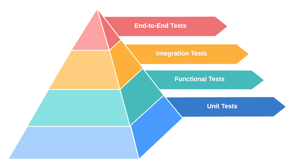
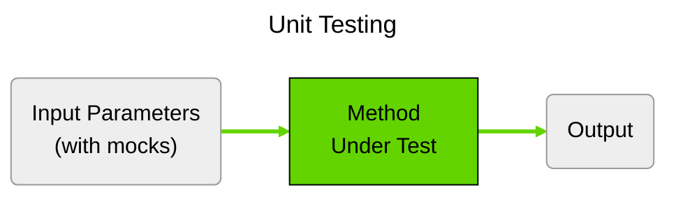
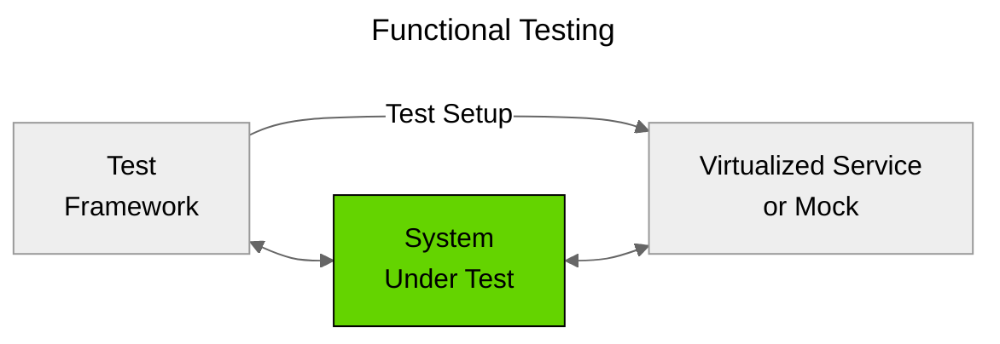
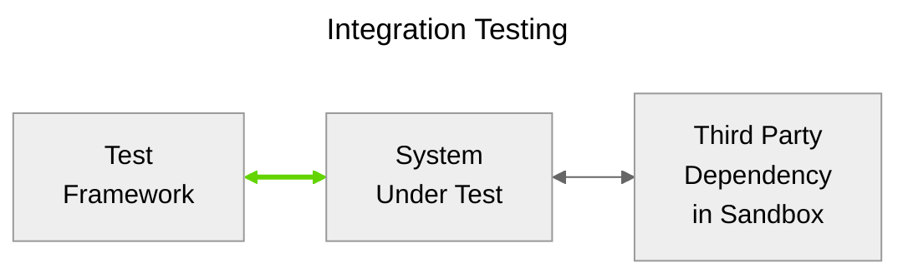
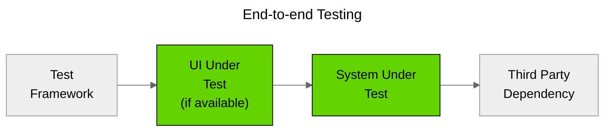
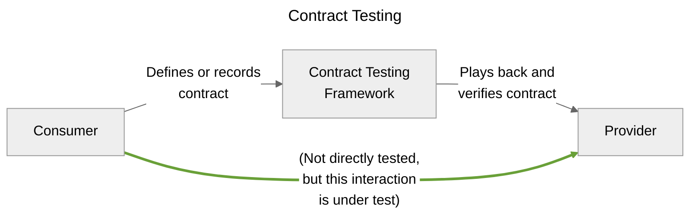
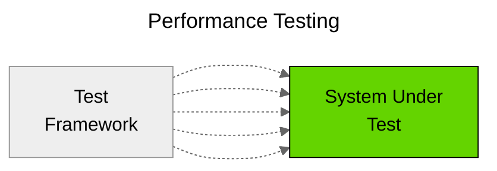

# Testing Strategy

## Overview

Our testing strategy is based on the concept of a test pyramid. This approach emphasizes the importance of writing more tests at the lower levels of code to ensure correctness. With additional tests at functional and system levels, we ensure that different aspects of the application are thoroughly tested, from individual units to integrated systems. The test pyramid strategy advocates for a reduction in the number of tests as we move to higher levels of the pyramid. This means that while unit tests are numerous and cover small, isolated pieces of functionality, integration and end-to-end tests are fewer but focus on broader, more comprehensive scenarios. This balance helps maintain efficient and effective testing processes.

## Unit Tests

Unit tests check that the building blocks of our codebase work correctly on their own. These tests are very focused and run quickly, giving developers almost immediate feedback. They should be fully isolated from other parts of the code (using mock objects), and run in a completely deterministic fashion without intermittent failures. Code coverage by unit tests is reported on, and should tend to 100% coverage. Comprehensive test coverage allows developers to make changes with confidence, since they can rely on a unit test failing if they have made a change that breaks some existing functionality.

Unit testing frameworks provide a structured way to write and run tests, as well as tools for assertions and test discovery. In addition to verifying the correctness of individual functions or methods, unit tests can also be used to enforce coding standards and best practices by ensuring that code adheres to expected behaviors and patterns.

To achieve isolation, unit tests often make use of mocking libraries. These libraries allow developers to create mock objects that simulate the behavior of real dependencies, enabling the testing of code in isolation from external systems such as databases, web services, or file systems. This isolation is crucial for ensuring that unit tests are fast, reliable, and repeatable.

Furthermore, unit tests should be part of a continuous integration (CI) pipeline, where they are automatically executed whenever code changes are pushed to the repository. This practice helps catch regressions early and ensures that the codebase remains in a healthy state. By integrating unit tests into the CI pipeline, teams can maintain high code quality and reduce the risk of introducing defects into the production environment.

### What is under test?

A single unit of functionality, like a class method.

### When do they run?

Unit tests are run locally by developers before committing changes and also run as part of the Continuous Integration (CI) process.

### Representative technologies

- [Jacoco](https://www.jacoco.org/)
- [JUnit](https://junit.org/junit5/)
- [NUnit](https://nunit.org/)
- [Mockito](https://site.mockito.org/)
- [Moq](https://github.com/devlooped/moq)

## Functional Tests

Functional tests mimic how other systems interact with our components in a controlled environment. This helps us test specific components without interference from other components. These tests are designed to validate that the system behaves as expected under various conditions and inputs, according to the requirements and specifications.

### What is under test?

The interaction of a target component with its dependencies, using virtualized services or mocks to represent those dependencies.

### When do they run?

Functional tests are run locally by developers before committing changes and as part of the Continuous Integration (CI) process.

### Representative technologies

- [Wiremock](https://wiremock.org/)
- [Postman Mocking Service](https://learning.postman.com/docs/designing-and-developing-your-api/mocking-data/setting-up-mock/)

## Integration Tests

Integration tests ensure that different components or services of a system work well together. They focus on making sure the component under test itself integrates correctly, not the components that are further removed. These tests are crucial for identifying issues that may arise when individual units or modules interact with each other, such as data format mismatches, communication errors, or incorrect assumptions about how components should behave.

Integration tests typically involve testing the interactions between a few components at a time, rather than the entire system. This allows for more focused and manageable tests, which can be easier to diagnose and debug when issues are found. For example, an integration test might verify that a web service correctly processes requests and returns the expected responses when interacting with a back-end.

### What is under test?

The integration points between the component under test and what it integrates with.

### When do they run?

Integration tests are run as part of the Continuous Integration (CI) process, or as a separate workflow.

### Representative technologies

- [Postman Automated Tests](https://www.postman.com/automated-testing/)
- [Rest Assured](https://rest-assured.io/)

## End-to-End Tests

End-to-end (E2E) testing comprehensively validates the application's workflow from initiation to completion. End-to-end tests simulate real user scenarios, ensuring that the entire application stack, including the frontend, backend, and any external integrations, work together as expected. This type of testing is crucial for identifying issues that may not be apparent in isolated unit or integration tests, such as data flow problems and configuration issues.

End-to-end tests should be used judiciously due to their complexity and resource requirements. It is essential to prioritize critical user journeys and high-risk areas of the application to ensure that the most important functionalities are thoroughly tested. These tests typically run in a production-like staging environment to mimic real-world conditions as closely as possible.

### What is under test?

Target application's workflow as experienced by the user.

### When do they run?

Manually run when needed, which is not often.

### Representative technologies

- [Cypress UI Automation](https://www.cypress.io/)
- [Selenium UI Automation](https://www.selenium.dev/)

## Acceptance Tests

Acceptance tests validate that the software meets the business requirements defined by stakeholders. A widely adopted methodology for performing these tests is Behavior Driven Development (BDD). Acceptance tests are composed of a series of comprehensible statements that describe a specific feature, utilizing the structured format introduced by Dan North:

1. *Given* a scenario
2. *When* an action is performed
3. *And*, *Then* the desired outcome is observed

Acceptance tests are typically written in collaboration with stakeholders, product owners, and developers to ensure that all requirements are accurately captured and understood. This collaborative approach helps bridge the gap between technical and non-technical team members, ensuring that the software delivers the intended value to the end-users.

Acceptance tests also serve as living documentation for the system, providing a clear and up-to-date reference for how the software is expected to behave. This documentation can be invaluable for onboarding new team members, understanding the impact of changes, and maintaining the system over time.

### What is under test?

The software's compliance with the business requirements.

### When do they run?

After all other tests, before Production deployment.

### Representative technologies

- [Cucumber](https://cucumber.io/)

## Contract Tests

Contract tests make sure that different services or systems work together and adhere to a defined contract or API specification. The consumer (the one using the service) creates these tests, but the provider (the one offering the service) runs them. This way, the consumer can be sure that the service meets their needs. That is why they are sometimes called "consumer-driven" contract tests. Contract testing allows for the consumer and provider teams to develop their systems independently, and even on different timelines.

In addition to verifying that the provider service meets the consumer's expectations, contract tests can also be used to validate backward compatibility. This is important when updating a service, as it ensures that existing consumers will continue to function correctly without requiring immediate changes on their part. By running contract tests teams can catch compatibility issues early and address them before they impact production.

Contract tests facilitate better collaboration and communication between consumer and provider teams. By explicitly defining the expectations and requirements of each service, teams can avoid misunderstandings and reduce the risk of integration issues. This collaborative approach helps create a more robust and resilient system, where services can be developed and deployed independently while still ensuring interoperability.

### What is under test?

The integration points between multiple components or services.

### When do they run?

Contracts tests are run as a separate workflow.

### Representative technologies

- [Pact](https://docs.pact.io/)

## Performance Tests

Performance tests assess a system's capability to maintain operational integrity and adhere to predefined Service Level Objectives (SLOs) when multiple components interact under conditions of high stress or load. These tests are designed to evaluate how the system performs under various conditions, such as high user traffic, large data volumes, or intensive computational tasks. By simulating real-world scenarios, performance tests help identify potential bottlenecks, resource limitations, and areas for optimization.

Performance tests are crucial for ensuring that the system can meet its Service Level Agreements (SLAs), which are formal commitments made to customers regarding the expected performance and availability of the service. SLAs typically include metrics such as response time, throughput, and uptime, which are critical for maintaining customer satisfaction and trust. By conducting performance tests, organizations can validate that their systems can consistently meet these commitments, even under peak load conditions.

Service Level Objectives (SLOs) are specific, measurable goals that define the desired performance and reliability of a system. These objectives are often derived from SLAs and serve as internal benchmarks for evaluating the system's performance. Performance tests help ensure that the system meets its SLOs by providing data on key performance indicators (KPIs) such as latency, error rates, and resource utilization. By monitoring these metrics, teams can identify areas where the system may be falling short of its objectives and take corrective actions to improve performance.

Service Level Indicators (SLIs) are the actual measurements of the system's performance against the defined SLOs. These indicators provide a quantitative basis for assessing whether the system is meeting its performance and reliability goals. Performance tests generate SLIs by simulating various load conditions and measuring the system's response. This data is then used to evaluate the system's adherence to its SLOs and identify any deviations that may require attention.

There are four common types of performance tests:

1. **Load Tests** - Simulate a high traffic load to ensure application meets agreed-upon SLOs, and tests that SLIs are reported.
2. **Spike Tests** - Simulate a constant traffic load with intermittent bursts of extra-high traffic to ensure application remains responsive.
3. **Soak Tests** - Simulate a high traffic load for long durations of time to ensure application does not suffer from hard-to-diagnose problems such as memory leaks.
4. **Breakpoint Tests** - Simulate an unrealistically high traffic load to determine at which point the application begins to fail. Breakpoint Tests are not really tests in the sense that they do not have pass or fail criteria.

### What is under test?

Application performance under normal and peak loads, scalability, and the system's responsiveness.

### When do they run?

Performance tests run on a schedule, but infrequently.

### Representative technologies

- [Postman Performance Tests](https://learning.postman.com/docs/collections/performance-testing/performance-test-configuration/)
- [JMeter](https://jmeter.apache.org/)

## Security Tests

Security tests, including vulnerability scans, penetration tests, and ethical hacking, are designed to identify and mitigate security vulnerabilities in systems. These tests play a crucial role in ensuring that systems remain protected against malicious attacks, unauthorized access, and data breaches.

Vulnerability scans rely on automated tools that inspect the system for known security weaknesses. These scans can identify outdated software versions, missing patches, misconfigurations, and other common vulnerabilities.

Penetration tests, or pen tests, involve simulating real-world attacks on the system to identify exploitable vulnerabilities. These tests are typically conducted by security experts who use a combination of automated tools and manual techniques to probe the system for weaknesses.

Ethical hacking, also known as white-hat hacking, involves authorized attempts to breach the system's defenses to identify security weaknesses. Ethical hackers use the same techniques and tools as malicious hackers but operate with the organization's permission and within legal boundaries. The insights gained from ethical hacking can help organizations strengthen their security posture and protect against real-world attacks.

### What is under test?

Everything. An organization's security is only as strong as its weakest link, encompassing everything from code bases and infrastructure to human resources.

### When do they run?

Every quarter, or as determined by the organization.

### Representative technologies

- [CodeQL](https://codeql.github.com/)
- [Qualys](https://www.qualys.com/)
- [Metasploit](https://www.metasploit.com/)
- [OWASP ZAP](https://www.zaproxy.org/)

## Additional Topics

### Test Driven Development (TDD)

Test Driven Development (TDD) is a software development methodology where tests are written before the actual code. The process follows a simple cycle: write a test, run the test (which should fail initially), write the minimum amount of code to pass the test, and then refactor the code while ensuring that all tests still pass. This cycle is repeated for each new feature or functionality. TDD encourages developers to think about the design and requirements before writing the code, resulting in more modular and maintainable code. Since they are written first, the tests themselves serve as documentation for the code, providing clear examples of how the code is expected to behave.

### Observability

Care should be taken to ensure that proper logging and observability is put in place. This includes dashboards, monitors and alerts, which play a important role in pinpointing systemic and functional issues in applications. Logs, dashboards, monitors and alerts should be part of the testing scope, since they allow rapid response to production issues.

Logs should be comprehensive and structured, capturing key events, errors, and performance metrics. Dashboards should provide real-time visibility into the system's health, displaying critical metrics such as CPU usage, memory consumption, and response times. Monitors should be configured to track these metrics continuously, identifying any deviations from expected behavior. Alerts should be set up to notify the relevant teams immediately when issues are detected, enabling rapid response and mitigation.

Logs, dashboards, monitors, and alerts should be part of the testing scope, since they allow rapid response to production issues. During testing, it is essential to verify that logs are being generated correctly and contain all necessary information for troubleshooting. Dashboards should be reviewed to ensure they accurately reflect the system's state and provide actionable insights. Monitors should be tested to confirm they are effectively tracking the desired metrics and can detect anomalies. Alerts should be validated to ensure they trigger appropriately and reach the intended recipients without delay.

Some representative technologies are:

- [Dynatrace](https://www.dynatrace.com/)
- [New Relic](https://newrelic.com/)

### Code Quality Gates

"Code quality gates" should be put in that disallow merging code that does not fit code coverage and other metrics such as length of methods, duplicated code and so on. Code coverage is a popular metric used to measure how many lines of code are touched during the execution of automated tests. Other important metrics include cyclomatic complexity, which measures the complexity of the code by counting the number of linearly independent paths through the program. High cyclomatic complexity can indicate code that is difficult to understand, test, and maintain.

Furthermore, peer code reviews should be conducted as part of the code quality gate process. Code reviews provide an opportunity for team members to share knowledge, identify potential issues, and ensure that the code adheres to best practices. Automated tools can assist in this process by highlighting areas of concern, but human judgment is essential for evaluating the overall design and implementation.

Some representative technologies are:

- [Qodana](https://www.jetbrains.com/help/qodana/getting-started.html)
- [sonarqube](https://www.sonarsource.com/products/sonarqube/)

### Metrics for Test Effectiveness

While code coverage is a valuable metric for unit tests, higher levels of testing, such as integration tests, system tests, and acceptance tests, require different metrics to ensure comprehensive coverage. Here are some thoughts on metrics that can help assess the effectiveness of these higher levels of testing:

- **Defect Density**: Measures the number of defects found per unit of code or functionality. It can help identify areas with higher defect rates that may need more thorough testing.
- **Test Case Effectiveness**: Evaluates how well test cases are able to detect defects. This can be measured by the number of defects found versus the number of test cases executed.
- **Test Automation Coverage**: Measures the percentage of test cases that are automated versus manual. Higher automation coverage can lead to more efficient and consistent testing.

### Test Case Management

Test case management software allows development teams to effectively organize, maintain, and manage test cases. These test cases are essential for verifying that a system meets specified requirements and functions correctly. They are designed to be clear and detailed, ensuring that any new team member can easily execute them.

Some representative technologies are:

- [Tricentis](https://www.tricentis.com/products/test-management-jira)
- [Test Rail](https://www.testrail.com/)
- [Zephyr](https://smartbear.com/test-management/zephyr/)

### Artificial Intelligence (AI)

The use of Artificial Intelligence (AI) enhances productivity, especially when writing tests. Integrating modern AI tools into your development environment offers numerous benefits. AI offers real-time code suggestions for programming languages and frameworks commonly used in test automation. AI also generates boilerplate code for test cases, setup and teardown methods, and common testing patterns, saving time and allowing engineers to focus on test logic and scenarios rather than setup tasks. AI improves test coverage by suggesting various testing scenarios and edge cases that might not be immediately obvious.

Some representative technologies are:

- [Github Copilot](https://github.com/features/copilot)
- [DiffBlue](https://www.diffblue.com/diffblue-cover/)

### Mutation Testing

Software testing helps to ensure functionality and stability of software. However, ensuring the sufficiency of these tests is important. To ensure tests are comprehensive, teams create detailed test plans, measure code coverage, and implement mutation testing. Mutation testing, in particular, assesses the quality of existing tests.

Mutation testing is based on two hypotheses: the competent programmer hypothesis, which assumes software faults are due to small syntactic errors, and the coupling effect, which posits that simple faults can lead to more complex emergent faults. This testing involves introducing small random code changes called mutants. Tests are run against these mutants; if any test fails, the mutant is killed, indicating sufficient testing. If all tests pass, the mutant lives, revealing gaps in the test coverage.

Mutation testing often is not widely adopted due to the significant computational resources it demands. For this reason, it is most effective when applied to smaller, incremental changes within a codebase.
